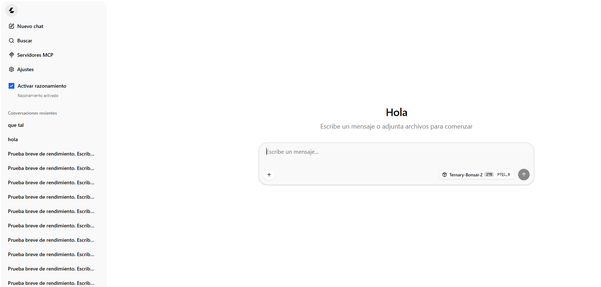
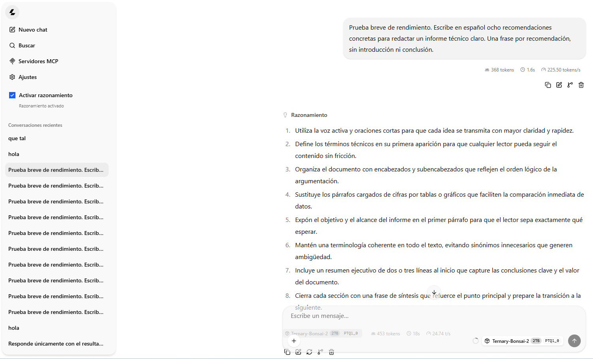

# Agente local Bonsai 2 27B

Preparé este proyecto para que puedas ejecutar **Bonsai 2 en tu propio computador**, conversar con él desde Python o usar una aplicación web local que muestra tablas, negritas y respuestas a medida que se generan.

Aquí comparto los seis scripts que utilizo para preparar el entorno, descargar **Ternary-Bonsai-2-27B PTQ1_0** y ponerlo en marcha en Windows con una GPU NVIDIA. Más abajo te explico cómo repetir la instalación y hacer tu primera consulta.

Uso Python para iniciar y controlar el modelo; quien genera las respuestas es el runtime de PrismML basado en llama.cpp. 

## Así se ve la aplicación

Pantalla de inicio, con la interfaz en español y el control de razonamiento en el menú lateral:



Ejemplo de respuesta a una consulta de redacción técnica:



### Velocidad observada

En mi **NVIDIA RTX 4070 Laptop de 8 GB** he observado **alrededor de 30 tokens por segundo de generación**, usando Bonsai 2 27B PTQ1_0 con el runtime CUDA de PrismML, sin DSpark.

Dejé el chat web configurado con contexto de 8192 tokens, salida máxima de 4096, razonamiento activado con esfuerzo `medium`, 8 hilos de CPU y carga de capas en la GPU. La velocidad cambia según la consulta, el contexto, los ajustes del navegador y lo que esté haciendo el equipo.

La captura de respuesta muestra **24,74 tokens/s** para esa consulta concreta. Los **225,50 tokens/s** que aparecen junto al mensaje del usuario corresponden al procesamiento de la entrada. Con thinking, el modelo puede generar tokens de razonamiento antes de mostrar texto al usuario.

## Qué contiene

| Archivo | Función |
|---|---|
| `001 - Preparar entorno.py` | Busca un entorno compatible con Python 3.12 y crea uno si hace falta. |
| `002 - Descargar modelo y runtime.py` | Descarga los recursos oficiales y comprueba tamaño y SHA256. |
| `003 - Primer llamado.py` | Hace una consulta y cierra el modelo al terminar. |
| `004 - Chat web.py` | Carga el modelo y abre la aplicación en el navegador. |
| `005 - Crear acceso directo bonsai.py` | Crea o actualiza el acceso del escritorio con un icono de bonsái y la firma NC. |
| `007 - Chat persistente en python.py` | Mantiene el modelo cargado para usar `agente()` en la consola Python. |
| `rutas.py` | Lee las ubicaciones privadas de cada instalación. |
| `rutas_ejemplo.txt` | Plantilla vacía para configurar esas ubicaciones. |
| `app/` | Lanzador web, cierre automático, configuración e interfaz. |

No hace falta instalar paquetes de Python adicionales: estos scripts utilizan la biblioteca estándar. La interfaz ya está compilada; no necesitas Node.js.

## Requisitos

- Windows de 64 bits y **Python 3.12** instalado.
- GPU NVIDIA y driver compatible con el runtime CUDA 12.4. `nvidia-smi` debe estar disponible.
- Espacio para el modelo de 5,95 GB, los ZIP del runtime y CUDA, y sus archivos extraídos. Conviene disponer de al menos 12 GB libres; el descargador comprueba espacio antes de continuar.
- Conexión a internet para la descarga inicial y un navegador moderno para el chat web.

Lo he utilizado en mi RTX 4070 Laptop de 8 GB. Los scripts no instalan ni modifican drivers y no utilizan DSpark. Los 5,95 GB corresponden al archivo del modelo: al ejecutarlo también hace falta memoria para el contexto y otros recursos.

## Antes de empezar

Para la instalación, los bloques marcados como `bat` se ejecutan en **Símbolo del sistema de Windows (cmd)**, no en la consola Python. Puedes abrir `cmd` desde el menú Inicio. PyCharm es opcional para la web; más abajo explico también cómo usar su consola Python.

Comprueba que tienes Python 3.12 y que Windows reconoce la GPU NVIDIA:

```bat
py -3.12 --version
nvidia-smi
```

El primer comando debe mostrar `Python 3.12.x`; el segundo, la GPU y su driver. Si alguno falla, resuelve la instalación de Python o del driver NVIDIA antes de continuar.

## 1. Descargar el proyecto y configurar las rutas

Descarga el ZIP del repositorio desde **Code → Download ZIP** y extráelo, o clónalo en una carpeta nueva. Usa como raíz del proyecto la carpeta donde aparecen los scripts numerados y la carpeta `app/`, no la carpeta que los contiene por fuera.

Copia `rutas_ejemplo.txt` como **`rutas_locales.txt`**, al lado de los scripts, y ábrelo con el Bloc de notas para completar las cuatro rutas. Guarda el archivo en UTF-8. Escribe una ruta por línea después del signo `=`, sin comillas ni barras duplicadas; los espacios dentro de las rutas se conservan. Puedes dejar líneas vacías y comentarios en líneas que empiecen con `#`. Ejemplo ficticio: sustituye `TU_USUARIO` y las carpetas por tus valores reales.

```text
PATH_PROYECTO = C:\Users\TU_USUARIO\...\AGENTE_LOCAL_BONSAI_2_27B
PATH_AMBIENTES = C:\Users\TU_USUARIO\...\AMBIENTES_PYTHON
PATH_MODELOS = C:\Users\TU_USUARIO\...\MODELOS_DESCARGADOS
PATH_PYTHON = C:\Users\TU_USUARIO\...\AMBIENTES_PYTHON\bonsai_27b\Scripts\python.exe
```

- `PATH_PROYECTO`: carpeta que contiene los seis scripts y `app/`.
- `PATH_AMBIENTES`: directorio externo donde buscar o crear entornos Python.
- `PATH_MODELOS`: directorio externo de pesos. **Créalo antes del paso 002.**
- `PATH_PYTHON`: intérprete del entorno elegido; debe estar dentro de `PATH_AMBIENTES`.

Si es tu primera instalación, `PATH_PYTHON` puede apuntar al futuro entorno `bonsai_27b`, como en el ejemplo: el paso siguiente lo crea si no encuentra otro compatible. Después comprobarás que esta ruta coincide con la que muestra el script.

El archivo local está excluido de Git. No pongas pesos ni entornos dentro del proyecto. Las rutas deben ser absolutas; no se expanden variables como `%USERPROFILE%` dentro del TXT. Reinicia la consola Python si cambias estas rutas durante una sesión.

## 2. Preparar el entorno

En cmd, entra en la carpeta del proyecto y ejecuta el primer script. Sustituye la ruta de este ejemplo por tu `PATH_PROYECTO`:

```bat
cd /d "C:\Users\TU_USUARIO\...\AGENTE_LOCAL_BONSAI_2_27B"
py -3.12 "001 - Preparar entorno.py"
```

El script busca Python 3.12 en los entornos existentes. Si no encuentra uno compatible, crea `bonsai_27b` dentro de `PATH_AMBIENTES`. 

Al terminar muestra la ruta del intérprete elegido. **Copia esa ruta en `PATH_PYTHON` de `rutas_locales.txt`**, si es distinta de la que habías indicado.

Activa ese entorno en la misma ventana de cmd. Por ejemplo, si se creó `bonsai_27b` en la ubicación del TXT anterior:

```bat
call "C:\Users\TU_USUARIO\...\AMBIENTES_PYTHON\bonsai_27b\Scripts\activate.bat"
python -c "import sys; print(sys.executable)"
```

Adapta la ruta si el script eligió otro entorno. La última línea debe mostrar el mismo intérprete que pusiste en `PATH_PYTHON`. Mantén esta terminal abierta para los siguientes pasos.

**Si usas PyCharm:** abre la carpeta del proyecto y selecciona ese mismo `python.exe` como intérprete existente en **Settings → Project → Python Interpreter**. Reinicia la consola Python si estaba abierta. Seleccionar un intérprete en PyCharm no activa automáticamente una ventana de cmd que ya tenías abierta.

## 3. Descargar modelo y runtime

```bat
python "002 - Descargar modelo y runtime.py"
```

Los pesos se guardan en `PATH_MODELOS/Ternary-Bonsai-2-27B/`. Los ejecutables y sus ZIP quedan junto al modelo, en `PATH_MODELOS/Ternary-Bonsai-2-27B/runtime/prism-b10709-9a9394a/`. `rutas.py` calcula esta ubicación como `PATH_RUNTIME`: no necesitas agregar otra ruta al TXT. Los proyectos que usen el mismo `PATH_MODELOS` compartirán esta instalación; no hace falta un runtime por proyecto. Los archivos existentes se verifican y reutilizan; no se sobrescriben si su contenido es distinto.

La descarga verifica tamaño y SHA256 fijados en el código. Si una descarga queda incompleta, el archivo `.part` se conserva y se informa el error; **no hay reanudación automática**. Revisa ese parcial antes de decidir eliminarlo y volver a descargar. No ejecutes dos descargas simultáneas.

### Recursos fijados

| Recurso | Versión |
|---|---|
| Modelo | [prism-ml/Ternary-Bonsai-2-27B-gguf](https://huggingface.co/prism-ml/Ternary-Bonsai-2-27B-gguf), revisión `6ed5e12bf84b7a63069882c91dd9e9218647d17b` |
| Archivo | `Ternary-Bonsai-2-27B-PTQ1_0.gguf`, 5.946.648.928 bytes |
| SHA256 del modelo | `53107f530aa52eb00912263ab1ee29bd199261c87cd7b4ad4ca1318c1fe33ee3` |
| Runtime | [PrismML llama.cpp prism-b10709-9a9394a](https://github.com/PrismML-Eng/llama.cpp/releases/tag/prism-b10709-9a9394a), Windows x64 CUDA 12.4 |
| Bibliotecas CUDA | [llama.cpp b10964](https://github.com/ggml-org/llama.cpp/releases/tag/b10964), paquete CUDA 12.4 |

Esta distribución usa **Bonsai 2 ternario PTQ1_0**. No sustituyas el runtime por otro sin comprobar que admite este formato.

## 4. Primera consulta

Para comprobar que todo funciona, ejecuta el `003` con la pregunta que dejé de ejemplo. Después puedes editar la variable `pregunta` para consultar lo que quieras:

```bat
python "003 - Primer llamado.py"
```

El modelo se carga para esa consulta y se cierra al terminar. Se muestran la respuesta, el tiempo total y las métricas disponibles. La respuesta y el registro técnico se guardan en `privado/consultas_terminal/`, excluido de Git.

## 5. Abrir el chat web

Con los pasos anteriores completados, puedes elegir entre el chat web (`004`) o la consola Python (`007`); **no necesitas ejecutar el 007 para abrir la web**. Para usar la web, cierra cualquier otra instancia del modelo.

**Desde cmd (Símbolo del sistema de Windows):** sustituye `PATH_PROYECTO` y `PATH_PYTHON` por las rutas completas que configuraste en `rutas_locales.txt`, conservando las comillas, y ejecuta estas dos líneas:

```bat
cd /d "PATH_PROYECTO"
"PATH_PYTHON" -X utf8 "004 - Chat web.py"
```

Estos nombres son marcadores para sustituir: cmd no los lee automáticamente del TXT. No necesitas activar el entorno, porque el segundo comando usa directamente su intérprete. Mantén la ventana de cmd abierta mientras uses el chat.

Al terminar la carga se abre [el chat local](http://127.0.0.1:8088/) en el navegador predeterminado. Si no se abre automáticamente, visita esa dirección. Escribe un mensaje y envíalo para comprobar que recibes la respuesta progresivamente. Mantén abierto el proceso de Python mientras usas la web.

También puedes llamarlo desde la consola Python de PyCharm, con la raíz del proyecto como directorio de trabajo:

```python
import runpy
from rutas import PATH_PROYECTO

runpy.run_path(str(PATH_PROYECTO / "004 - Chat web.py"))
```

La llamada permanece activa mientras funciona la web. Para cambiar los valores iniciales, cierra la aplicación, edita el `004` y vuelve a ejecutarlo:

| Parámetro | Valor inicial | Para qué sirve |
|---|---|---|
| `contexto` | `8192` | Espacio total para la entrada, el historial y la generación. |
| `max_tokens` | `4096` | Límite de salida, incluido el razonamiento. |
| `thinking` | `True` | Activa el razonamiento; usa `False` para desactivarlo. |
| `esfuerzo` | `'medium'` | Esfuerzo solicitado al runtime; el lanzador también admite `'xhigh'`. |
| `puerto` | `8088` | Puerto de la web local. |

En el menú lateral puedes activar o desactivar thinking. Los ajustes guardados en el navegador pueden prevalecer sobre los valores iniciales del script. El límite de salida incluye el razonamiento y la respuesta visible; además, entrada + historial + generación deben caber en el contexto total.

La aplicación escucha solo en localhost. No está preparada para exponerse a internet.

### Cerrar y liberar memoria

Cerrar la última pestaña del chat activa el cierre del modelo tras unos 8 segundos. Si hay más pestañas del chat abiertas, la sesión continúa. Si el navegador termina abruptamente, la detección puede tardar unos 3 minutos; una pestaña suspendida también puede caducar.

Evita forzar la terminación de Python: puede dejar un proceso del runtime abierto. Cierra primero las pestañas y espera a que aparezca «Servidor detenido».

### Acceso directo en el escritorio

Después de completar la instalación, ejecuta una vez desde la terminal del proyecto:

```bat
python "005 - Crear acceso directo bonsai.py"
```

Se crea **Bonsai 2 - Chat local** en tu escritorio, con un icono de bonsái y el monograma **NC** pequeño en una esquina. Un doble clic ejecuta el `004`, inicia Python con la consola minimizada y abre la web cuando el modelo está listo. No necesitas abrir PyCharm. El script reconoce el escritorio de OneDrive y actualiza el acceso si ya existe.

Usa este acceso cuando el modelo esté cerrado; si la web ya está abierta, vuelve a esa pestaña. Al cerrar la última pestaña del chat, el lanzador detiene el modelo y libera su memoria tras unos 8 segundos. Si cambias de carpeta o de intérprete, vuelve a ejecutar el `005`. El acceso contiene tus rutas locales y no se sube a GitHub.

## Alternativa: conversar y calcular en la consola Python

Preparé el `007` para poder conversar con el modelo y seguir haciendo cálculos en la misma consola. **No lo ejecutes a la vez que la web.**

Abre **Python Console** en PyCharm, con el intérprete configurado en el paso 2 y la raíz del proyecto como directorio de trabajo. Ejecuta este bloque una sola vez y espera el mensaje «Listo»:

```python
from rutas import PATH_PROYECTO

exec((PATH_PROYECTO / "007 - Chat persistente en python.py").read_text(encoding="utf-8"))
```

Después, cada vez que quieras escribir una pregunta, ejecuta:

```python
agente()  # Aparece «Tú:»; escribe la pregunta sin comillas y pulsa Enter.
```

También puedes pasarle texto directamente y combinarlo con tus cálculos:

```python
total = 500 * 1.19
agente(f"Explica este resultado: {total}")
```

Estas son otras opciones que puedes usar cuando las necesites:

```python
respuesta = agente("Resume nuestra conversación", mostrar=False)
```

- `limpiar_historial()` empieza una conversación nueva.
- `cerrar_modelo()` cierra el modelo y libera su memoria cuando termines.

El `007` necesita una consola que siga abierta: si lo ejecutas como un script que termina inmediatamente, el modelo también se cierra. Por eso uso `exec(...)` dentro de la consola Python en este ejemplo.

La respuesta aparece progresivamente. Tus variables no se comparten automáticamente: inclúyelas en el texto si quieres que el modelo las conozca. Cierra el modelo del `007` antes de abrir la web. El `007` usa el puerto 8090.

## Privacidad y almacenamiento

- Los chats web se guardan en el almacenamiento del navegador. Cambiar de navegador, perfil o puerto puede mostrar un historial distinto.
- `app/datos/registros/` contiene registros técnicos de ejecución; está excluido de Git.
- `app/web_ui/chat-session.js` se genera al iniciar y no se versiona.


## Problemas habituales

| Mensaje o síntoma | Qué revisar |
|---|---|
| Falta `rutas_locales.txt` | Copia la plantilla y completa las cuatro rutas. |
| No encuentra `rutas` | En una consola interactiva, sitúa el directorio de trabajo en la raíz del proyecto. |
| GPU ocupada | Cierra juegos u otros chats; en el 007 usa `cerrar_modelo()`. El 004 evita cargar otra copia cuando observa más de 2300 MiB usados. |
| Puerto 8088 ocupado | Revisa si ya hay una instancia web abierta. Cierra esa instancia antes de iniciar otra. |
| Solo aparece «Pensando» o una respuesta cortada | Desactiva thinking para la siguiente consulta o ajusta el máximo de salida y el contexto disponible. |
| Falta el modelo o runtime | Ejecuta el 002 y revisa las rutas. |
| No carga con CUDA | Revisa el driver NVIDIA y el registro de esa ejecución en `app/datos/registros/`. |

## Alcance y componentes de terceros

Comparto los scripts y la aplicación que utilizo para que puedas probarlos en tu equipo. No desarrollé el modelo ni el motor de inferencia: uso el modelo de PrismML y su runtime basado en llama.cpp. La interfaz web también incorpora componentes de terceros.

Puedes consultar [THIRD_PARTY_NOTICES.md](THIRD_PARTY_NOTICES.md) y la carpeta [LICENSES](LICENSES/) para conocer su procedencia y los avisos de licencia. Los pesos y binarios se descargan por separado de sus distribuidores oficiales.

## Una mención si te resulta útil

Soy **Nahuel Canelo** y comparto este trabajo de integración, adaptación y documentación para facilitar el uso local de Bonsai. Si te resulta útil y lo compartes o adaptas, agradecería que me mencionaras y enlazaras [este repositorio](https://github.com/Nahuel247/AGENTE_LOCAL_BONSAI_2_27B).

Es una solicitud voluntaria, no una condición adicional de licencia. Mi aporte no sustituye los créditos de PrismML, llama.cpp, llama-ui ni de los demás componentes utilizados; sus avisos y licencias se mantienen.
